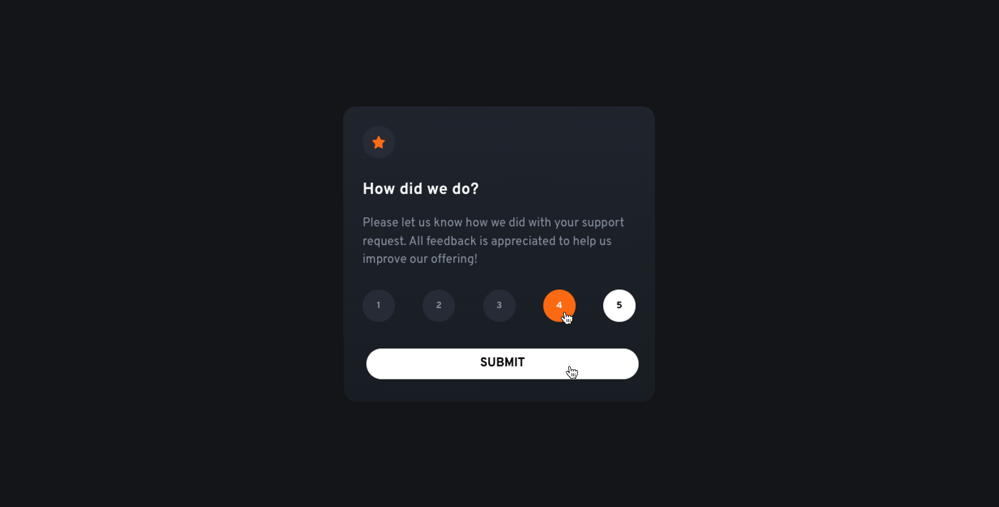

# Interactive Rating Component

The Interactive Rating Component is a modern web application designed to collect user feedback effectively. Built using React and Tailwind CSS, this project showcases the creation of a responsive and user-friendly application that can be adapted for any company in any industry.

## Live Demo

[⭐ Interactive Rating Component](https://technical-assignment-plum.vercel.app/)

## Technologies and Techniques Used

 Core library for building user interfaces.  
 Utility-first CSS framework for rapid styling.  
 The programming language used for app logic.

## Visual Overview

## Features

- **User Rating:** Allows users to select a rating from 1 to 5, providing quick feedback.
- **Customizable Feedback Fields:** Fields can be adjusted based on clients’ specific needs to gather relevant insights.
- **Responsive Design:** Optimized for both desktop and mobile devices to enhance user experience.
- **Real-time Interaction:** Immediate feedback display upon user selection for a smooth interaction.
- **User Engagement:** Engaging UI elements to encourage users to provide their feedback.
